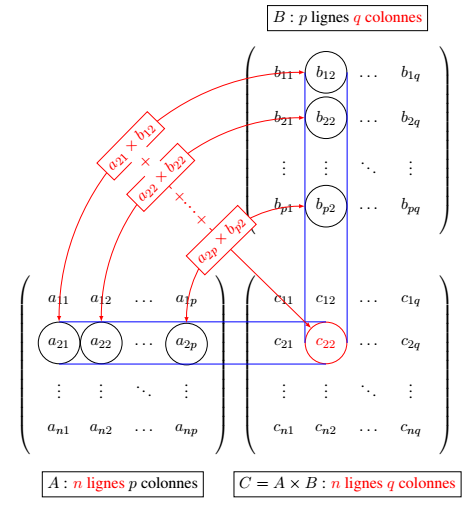
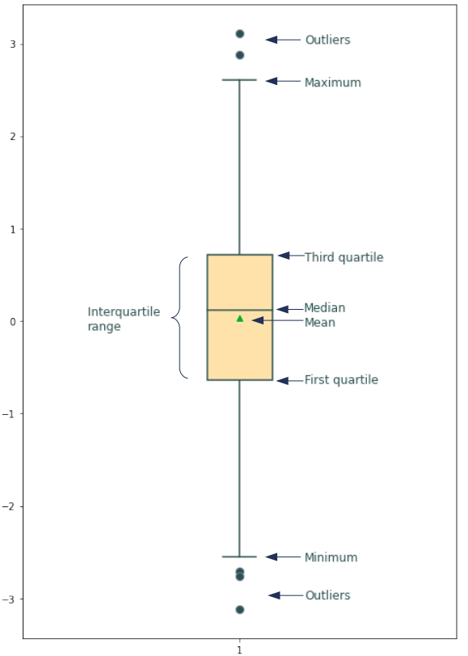
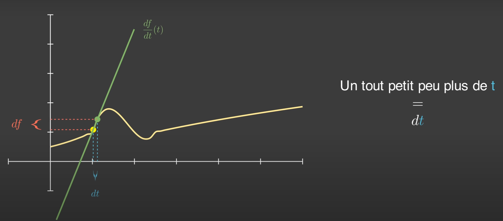

# philomathia
Veille sur les Mathématiques

Définition simple des notions suivantes avec au moins un exemple à chaque
fois :

# Table des matières

[Définitions courtes](#Définitionscourtes)
1. [Vecteur](#vecteur)
2. [Matrice](#matrice)
3. [Probabilité et Loi de probabilité](#probabilité-et-loi-de-probabilité)
4. [Variables indépendantes](#variables-indépendantes)
5. [Espérance, Variance et Écart type](#espérance-variance-et-écart-type)
6. [Corrélation linéaire](#corrélation-linéaire)
7. [Moyenne, Médiane, Maximum, Minimum](#moyenne-médiane-maximum-minimum)
8. [Quartiles en statistique](#quartiles-en-statistique)
9. [Boxplot en statistique](#boxplot-en-statistique)
10. [Histogramme en statistique](#histogramme-en-statistique)
11. [Théorème Central Limite](#théorème-central-limite)
12. [Dérivée](#dérivée)

---

## Définitions courtes

**Vecteur**

Liste ordonnée de nombres, représentant souvent des points dans un espace multidimensionnel.

**Matrice**

Tableau rectangulaire de nombres organisés en lignes et colonnes, utilisé pour les opérations linéaires.

**Probabilité, loi de probabilité**

Mesure de la chance qu'un événement se produise ; la loi de probabilité décrit toutes les probabilités possibles d'un ensemble d'événements.

**Variables indépendantes**

Variables sans relation directe entre elles ; la variation de l'une n'affecte pas la variation de l'autre.

**Espérance, variance et écart type**

   - **Espérance** : Moyenne théorique des valeurs d'une variable.
   - **Variance** : Mesure de la dispersion autour de la moyenne.
   - **Écart type** : Racine carrée de la variance, indiquant la dispersion autour de la moyenne.

**Corrélation linéaire**

Mesure de la relation linéaire entre deux variables ; elle varie de -1 (corrélation inverse) à +1 (corrélation directe).

**Moyenne, médiane, maximum, minimum**
   - **Moyenne** : Somme des valeurs divisée par leur nombre.
   - **Médiane** : Valeur centrale d'un ensemble trié.
   - **Maximum** : Plus grande valeur.
   - **Minimum** : Plus petite valeur.

**Quartiles en statistique**

Valeurs qui divisent un ensemble de données en quatre parties égales.

**Boxplot en statistique**

Diagramme qui résume la distribution des données en affichant les quartiles et les valeurs extrêmes.

**Histogramme en statistique**

Graphique montrant la répartition des données en regroupant les valeurs en classes.

**Théorème central limite**

Théorème indiquant que la somme de variables aléatoires indépendantes suit une distribution normale lorsque le nombre de variables est suffisamment grand.

**Dérivée**

Mesure de la variation instantanée d'une fonction ; représente le taux de changement d'une variable par rapport à une autre.


## Vecteur

### En mathématiques, un vecteur peut être défini de plusieurs façons :

1. Représentation géométrique :
Un vecteur est une quantité ayant une longueur, une direction et un sens.
Il est représenté par une flèche allant d'un point à un autre.

2. Liste ordonnée de nombres :
Un vecteur peut être vu comme une liste ordonnée de nombres réels, généralement notée sous forme de colonne ou de ligne.
Par exemple :(x1,x2,...,xn)

3. Élément d'un espace vectoriel : En algèbre linéaire, un vecteur est un élément d'un espace vectoriel, qui obéit à certaines propriétés comme l'addition vectorielle et la multiplication scalaire.

### Un vecteur en statistique

1. Représenter des échantillons : Un vecteur peut contenir les observations d'une variable particulière pour un ensemble d'individus.

2. Stocker des variables multiples : Plusieurs caractéristiques d'un même individu peuvent être regroupées dans un vecteur.

## Matrice

Définition d'une matrice et son utilisation dans les calculs statistiques.


### Matrice avec Numpy

Il y a plusieurs méthodes pour créer une matrice avec python :

```python
A = np.array([[1, 2], [ 3, 4]])

B = np.matrix([[1, 2], [3, 4]])

C = np.matrix('[1,2;3,4]', dtype=np.int32)

D = np.array([np.arange(1,3), np.arange(3,5)])

E = np.arange(1,5).reshape(2,2)
```


### Définition d'une matrice

Une matrice est une structure de données bidimensionnelle, disposés en lignes et colonnes.
C'est donc une grille rectangulaire de nombres organisée en lignes et colonnes. Les matrices peuvent représenter des transformations linéaires, c'est-à-dire des opérations qui transforment un vecteur d'un espace vectoriel en un autre. Par exemple, une matrice \(A\) de dimensions \(m \times n\) peut transformer un vecteur \(x\) en un autre vecteur \(A x\).

**Addition de matrices** : 
\[
A + B
\]
où \(A\) et \(B\) ont les mêmes dimensions.

**Multiplication de matrices** :
\[
A B
\]
où le nombre de colonnes de \(A\) doit être égal au nombre de lignes de \(B\).


En statistiques, elle peut représenter :

- Un ensemble d'observations sur plusieurs variables
- Des données structurées pour l'analyse multivariée
- Des coefficients pour des systèmes d'équations

### Utilisation dans les calculs statistiques

- Représentation des données
- Analyse multivariée
- Calculs matriciels
- Modélisation statistique
- Inférence statistique

### Calcul matriciel
n'est possible que si le nombre de colonnes de la première matrice est égal au nombre de lignes de la seconde

La matrice résultat aura autant de lignes que la première matrice et autant de colonnes que la seconde.

Le produit matriciel est possible dans les "2 sens" mais il n'est pas commutatif : N x M différent de M x N
Sauf avec une matrice identité ou une matrice nulle.


**Produit matriciel**

**version 1 :**
$$c_{ij} = \sum_{k=1}^{n}a_{ik} \cdot b_{kj} $$

**Explications**
| Symbole | Signification | Représentation mathématique |
|---------|---------------|---------------------------|
| Σ | Somme | $$\sum$$ |
| Σ avec limites | Somme pour k allant de 1 à n | $$ \sum_{k=1}^{n}$$ |


**Version 2 :**
$$c_{ij}  = a_{i1} \cdot b_{1j} + a_{i2} \cdot b_{2j} + \cdots + a_{in} \cdot b_{nj}$$

### Matrice identité
$$ \begin{pmatrix}
1 & 0 & 0 \\
0 & 1 & 0 \\
0 & 0 & 1
\end{pmatrix}$$

La multiplication d'une matrice par une matrice identité retourne la matrice originale.
Le produit scalaire avec une matrice identité est commutatif.

### Matrice inverse et déterminant
Matrice
$$ M = \begin{pmatrix}
a & b \\
c & d
\end{pmatrix}$$
Une matrice est inversible si et seulement si son déterminant est non nul :

det(M) $ \neq $ 0
$$det(M) = (a \times d) - (c \times b) \neq 0$$
On définit alors $M^{-1}$ comme suit :
$$ M^{-1} = \frac{1}{det(M)} \times \begin{pmatrix}
d & -b \\
-c & a
\end{pmatrix} $$

## Probabilité et Loi de probabilité
Introduction aux probabilités et aux lois de probabilités comme la loi normale, la loi binomiale, etc.

## Variables indépendantes
Définition et explication des variables indépendantes dans le cadre des probabilités et statistiques.

**variance** (carré de l'écart type) écart quadratique moyen avec la moyenne


## Espérance, Variance et Écart type
Formules et interprétations de l'espérance, de la variance et de l'écart type d'une distribution.


## Corrélation linéaire
Présentation de la corrélation linéaire, du coefficient de corrélation et de leur interprétation.

### Corrélation Linéaire de Pearson
Coefficient de Corrélation de Pearson
est une mesure de la corrélation linéaire entre deux variables.

Il est noté $𝑟$ et varie entre -1 et 1

$r >0 $  : Corrélation positive (lorsque l'une des variables augmente, l'autre tend à augmenter aussi).

$r<0$ : Corrélation négative (lorsque l'une des variables augmente, l'autre tend à diminuer).

#### $r = 1$
Corrélation linéaire positive parfaite
Les variables augmentent ensemble de manière linéaire.


#### $r = 0$
Aucune corrélation linéaire
Les variables sont indépendantes ou la relation n'est pas linéaire.


#### $r = −1$
Corrélation linéaire négative parfaite
Lorsque l'une des variables augmente, l'autre diminue de manière linéaire.


#### Interprétation de la force de la corrélation :

$∣r∣$ est la valeur absolue du coefficient de corrélation, donc :
- toujours positive.
- mesure uniquement la force de la relation sans tenir compte de la direction.

- $∣r∣=1$
  relation linéaire parfaite (positive ou négative).

- $∣r∣$ proche de 0
  relation linéaire faible ou nulle, quelle que soit la direction.


#### La fonction Pandas `corr()`crée une matrice de corrélation
Chaque cellule représente le coefficient de corrélation de Pearson entre deux variables. La valeur de la corrélation varie entre -1 et 1 :
1 : Corrélation positive parfaite (les variables augmentent ensemble).
0 : Aucune corrélation linéaire.
-1 : Corrélation négative parfaite (lorsque l'une augmente, l'autre diminue).


#### Limites du coefficient de Pearson :
- N’indique pas une causalité mais simplement une association linéaire.
- Ne fonctionne bien que pour des relations linéaires.
- Si la relation entre les variables est non linéaire, Pearson pourrait donner 
r≈0, même si les variables sont fortement liées (par exemple, relation quadratique).

Exemple
Supposons que deux variables, x et y, soient liées de façon linéaire. Si leur coefficient de corrélation de Pearson est 0,9, cela indique une relation linéaire positive forte, où des augmentations de x sont généralement associées à des augmentations de y.


#### Autres coefficients de corrélation
Pour capturer des relations non linéaires ou pour des types de données différents :

- **Corrélation de Spearman** : Utilisée pour mesurer la corrélation monotone (ordre des valeurs) entre deux variables, adaptée aux distributions non normales.

- **Corrélation de Kendall** : Utilisée pour mesurer la corrélation entre deux variables ordinales.


## Moyenne, Médiane, Maximum, Minimum
Définitions des mesures de tendance centrale et des valeurs extrêmes.

- count : Le nombre de valeurs non nulles dans chaque colonne.
- mean : La moyenne des valeurs, utile pour voir les valeurs centrales.
- std : L'écart-type, qui indique la dispersion des données autour de la moyenne.
- min et max : Les valeurs minimum et maximum, montrent l'étendue des valeurs.
- Les quartiles 25%, 50% (médiane), 75% : donnent une idée de la distribution des données.

## Quartiles en statistique
Explication des quartiles, de leur calcul et de leur rôle dans la description des données.

## Boxplot en statistique
Description et interprétation du diagramme en boîte (Boxplot).


## Histogramme en statistique
Explication de l'histogramme et de son utilité dans la représentation des distributions de données.

## Théorème Central Limite
Présentation et explication du théorème central limite et de son importance en statistique.

## Dérivée
Définition de la dérivée et son application dans différents contextes, y compris la statistique.

Dérivation : étude des variations en un point

Cela n'as pas de sens d'étudier les variation sur un point.
Soit une courbe qui représente un déplacement, temps en abscisse, distance en ordonnée

**Dérivé selon Leibniz**
On veut signifier un changement infiniment petit d'une quantité t :
un tout petit peu plus de t = dt (notation de Leibnitz)
un tout petit peu plus de f = df

La pente de la séquence au point d'abcisse 1 vaut $\frac{df}{dt}_{(1)}$



